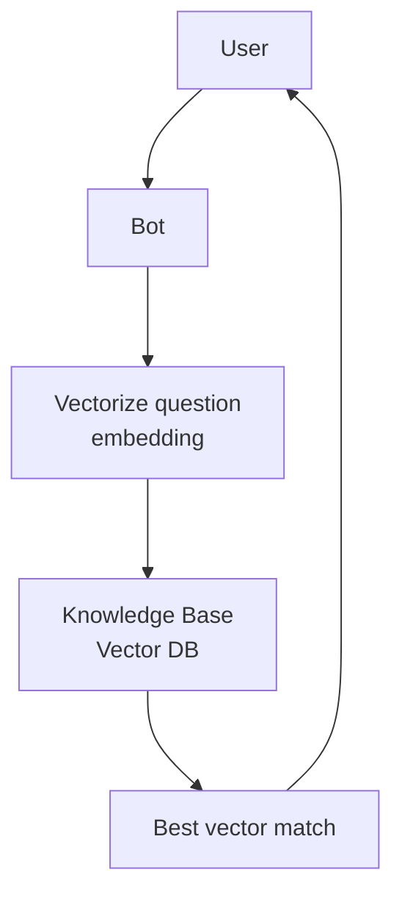

# Agent flowchart

```mermaid
%%{init: {"flowchart": {"nodeSpacing": 60, "rankSpacing": 70}} }%%
flowchart TD
  U["User"] --> BOT["Bot"]
  BOT --> EMB["Vectorize question<br/>embedding"]
  EMB --> KB["Knowledge Base<br/>Vector DB"]
  KB --> MATCH["Best vector match"]
  MATCH --> U
```

