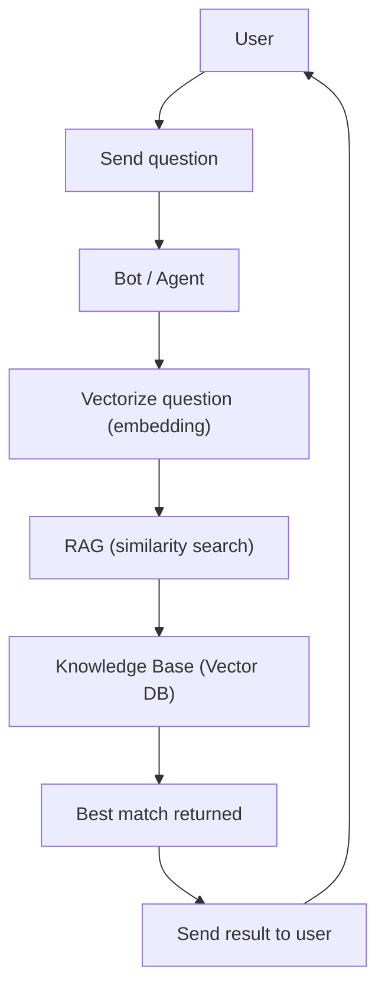

# Agentic system flowchart (first version)

```mermaid
flowchart TD
  U["User"] --> Q["Send question"]
  Q --> BOT["Bot / Agent"]
  BOT --> EMB["Vectorize question (embedding)"]
  EMB --> RAG["RAG (similarity search)"]
  RAG --> KB["Knowledge Base (Vector DB)"]
  KB --> MATCH["Best match returned"]
  MATCH --> RESP["Send result to user"]
  RESP --> U
```

