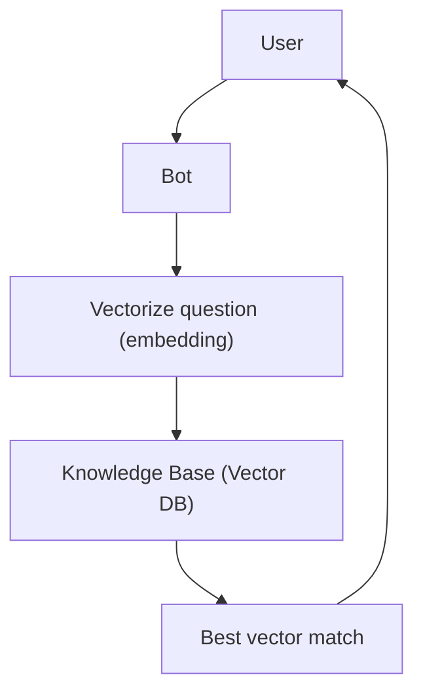

# Agentic system flowchart (last version)

```mermaid
flowchart TD
  U["User"] --> BOT["Bot"]
  BOT --> EMB["Vectorize question (embedding)"]
  EMB --> KB["Knowledge Base (Vector DB)"]
  KB --> MATCH["Best vector match"]
  MATCH --> U
```

